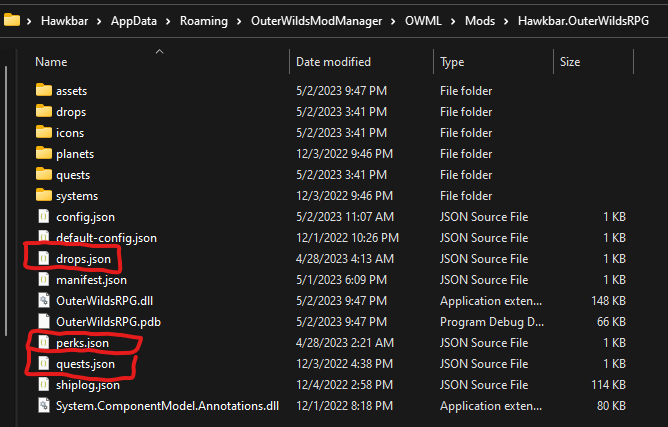
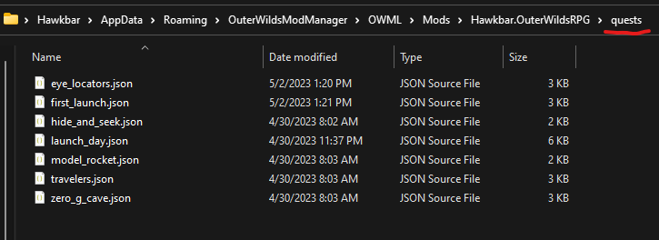

# Adding Content

You can add quests, drops, shops, and perks in either of two ways: top-level JSON files, or per-item JSON files.
## Top-Level JSON Files
If you have a small number of items, you can use a json file at the root of your project for each type of item (`quests.json`, `drops.json`, `shops.json`, or `perks.json`):



### quests.json
[View the JSON schema here.](/schemas/quests.html)
<?prettify?>
```js
{
	"$schema": "https://raw.githubusercontent.com/Hawkbat/OuterWildsRPG/main/schemas/quests.schema.json",
	"quests": [
		{
			"id": "MY_FIRST_QUEST",
			"name": "My Cool Quest",
			// etc.
		},
		{
			"id": "MY_SECOND_QUEST",
			"name": "My Other Cool Quest",
			// etc.
		}
	]
}
```
### drops.json
[View the JSON schema here.](/schemas/drops.html)
<?prettify?>
```js
{
	"$schema": "https://raw.githubusercontent.com/Hawkbat/OuterWildsRPG/main/schemas/drops.schema.json",
	"drops": [
		{
			"id": "MY_FIRST_DROP",
			"name": "A Very Rare Item",
			// etc.
		},
		{
			"id": "MY_SECOND_DROP",
			"name": "A Less Cool Item",
			// etc.
		}
	]
}
```
### shops.json
[View the JSON schema here.](/schemas/shops.html)
<?prettify?>
```js
{
	"$schema": "https://raw.githubusercontent.com/Hawkbat/OuterWildsRPG/main/schemas/shops.schema.json",
	"shops": [
		{
			"id": "MY_FIRST_SHOP",
			"name": "Shady Merchant",
			// etc.
		},
		{
			"id": "MY_SECOND_SHOP",
			"name": "Riebeck",
			// etc.
		}
	]
}
```
### perks.json
[View the JSON schema here.](/schemas/perks.html)
<?prettify?>
```js
{
	"$schema": "https://raw.githubusercontent.com/Hawkbat/OuterWildsRPG/main/schemas/perks.schema.json",
	"perks": [
		{
			"id": "MY_FIRST_PERK",
			"name": "Do Cool Stuff",
			// etc.
		},
		{
			"id": "MY_SECOND_PERK",
			"name": "Do Cool Stuff Better",
			// etc.
		}
	]
}
```
## Per-Item JSON Files
If you have many items, or wish to organize them independently, you can create individual .json files for each one, within the appropriate subfolder (`quests`, `drops`, `shops`, or `perks`). The individual file names do not matter, but you should ensure the `id` property of each item is unique:




View the relevant JSON schemas for each item type:
- [Quest Schema](/schemas/quest.html) (quests folder)
- [Drop Schema](/schemas/drop.html) (drops folder)
- [Shop Schema](/schemas/shop.html) (shops folder)
- [Perk Schema](/schemas/perk.html) (perks folder)
